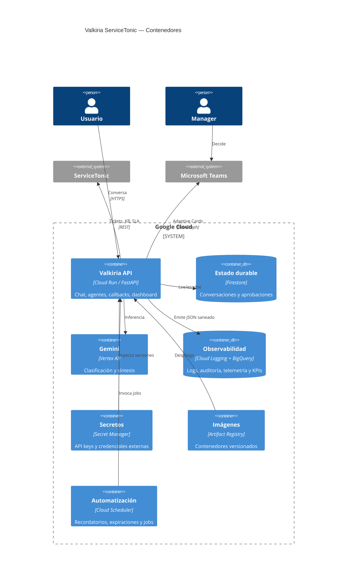

# Nivel 2 — Contenedores

```mermaid
C4Container
    title Valkiria ServiceTonic — Contenedores
    Person(usuario, "Usuario")
    Person(manager, "Manager")

    System_Boundary(gcp, "Google Cloud") {
        Container(api, "Valkiria API", "Cloud Run / FastAPI", "Chat, agentes, callbacks, dashboard")
        ContainerDb(state, "Estado durable", "Firestore", "Conversaciones y aprobaciones")
        Container(llm, "Gemini", "Vertex AI", "Clasificación y síntesis")
        ContainerDb(logs, "Observabilidad", "Cloud Logging + BigQuery", "Logs, auditoría, telemetría y KPIs")
        Container(secrets, "Secretos", "Secret Manager", "API keys y credenciales externas")
        Container(images, "Imágenes", "Artifact Registry", "Contenedores versionados")
        Container(scheduler, "Automatización", "Cloud Scheduler", "Recordatorios, expiraciones y jobs")
    }

    System_Ext(servicetonic, "ServiceTonic")
    System_Ext(teams, "Microsoft Teams")

    Rel(usuario, api, "Conversa", "HTTPS")
    Rel(api, servicetonic, "Tickets, KB, SLA", "REST")
    Rel(api, teams, "Adaptive Cards", "Bot/Graph")
    Rel(manager, teams, "Decide")
    Rel(api, state, "Lee/escribe")
    Rel(api, llm, "Inferencia")
    Rel(api, logs, "Emite JSON saneado")
    Rel(secrets, api, "Inyecta versiones")
    Rel(images, api, "Despliega")
    Rel(scheduler, api, "Invoca jobs")
```

## Despliegue local

Docker Compose mantiene un modo mock reproducible. Producción usa servicios
administrados de Google Cloud y no depende del filesystem local.
